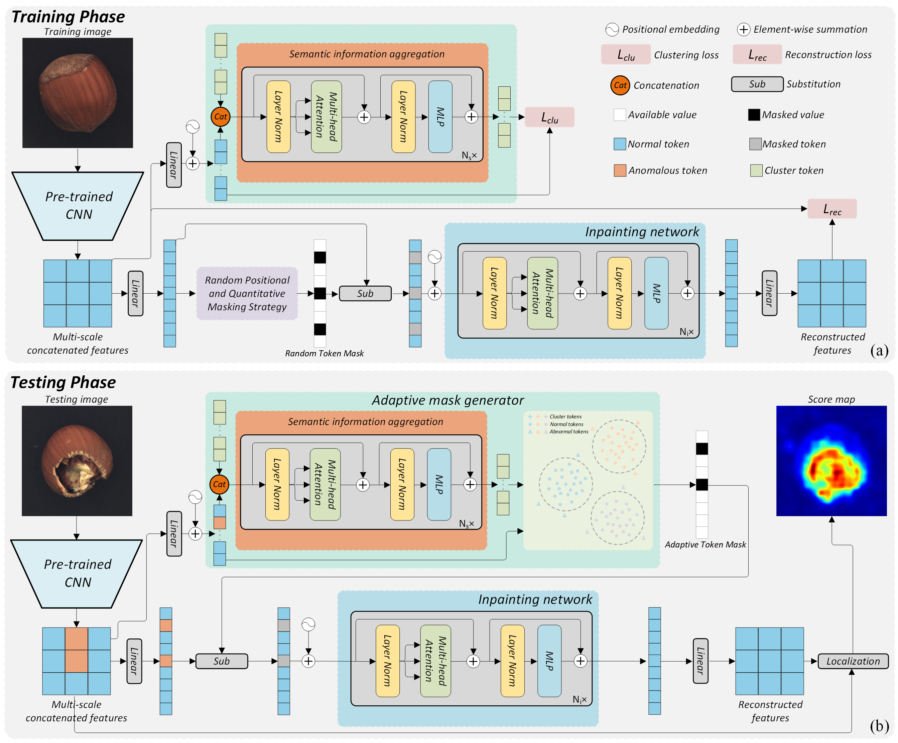

# [AMI-Net: Adaptive Mask Inpainting Network for Industrial Anomaly Detection and Localization (IEEE TASE 2024)](https://ieeexplore.ieee.org/document/10445116)
PyTorch implementation and for TASE2024 paper, AMI-Net: Adaptive Mask Inpainting Network for Industrial Anomaly Detection and Localization.  
  
# Download Datasets
Please download MVTecAD dataset from [MVTecAD dataset](https://www.mvtec.com/de/unternehmen/forschung/datasets/mvtec-ad/) and BTAD dataset from [BTAD dataset](https://www.beantech.it/).
# Download the Weights for the MVTec AD dataset
| Class      | Pre-trained Checkpoint | 
|------------|-------------------------|
| Bottle | [download](Releases/Pth/AMAE.pth) |
| Cable  | [download](https://github.com/your-username/your-repo/releases/download/v1.0/ViT-Large.pth) |
| Capsule | [download](https://github.com/your-username/your-repo/releases/download/v1.0/ViT-Huge.pth) |
| Carpet | [download](https://github.com/your-username/your-repo/releases/download/v1.0/ViT-Huge.pth) |
| Grid   | [download](https://github.com/your-username/your-repo/releases/download/v1.0/ViT-Huge.pth) |
| Hazelnut | [download](https://github.com/your-username/your-repo/releases/download/v1.0/ViT-Huge.pth) |
| Leather | [download](https://github.com/your-username/your-repo/releases/download/v1.0/ViT-Huge.pth) |
| Metal nut | [download](https://github.com/your-username/your-repo/releases/download/v1.0/ViT-Huge.pth) |
| Pill | [download](https://github.com/your-username/your-repo/releases/download/v1.0/ViT-Huge.pth) |
| Screw | [download](https://github.com/your-username/your-repo/releases/download/v1.0/ViT-Huge.pth) |
| Tile | [download](https://github.com/your-username/your-repo/releases/download/v1.0/ViT-Huge.pth) |
| Toothbrush | [download](https://github.com/your-username/your-repo/releases/download/v1.0/ViT-Huge.pth) |
| Transistor | [download](https://github.com/your-username/your-repo/releases/download/v1.0/ViT-Huge.pth) |
| Wood | [download](https://github.com/your-username/your-repo/releases/download/v1.0/ViT-Huge.pth) |
| Zipper | [download](https://github.com/your-username/your-repo/releases/download/v1.0/ViT-Huge.pth) |
# Citation
If you find this repository useful, please consider citing our work:  
```
@article{luo2024ami,    
  title={AMI-Net: Adaptive Mask Inpainting Network for Industrial Anomaly Detection and Localization},  
  author={Luo, Wei and Yao, Haiming and Yu, Wenyong and Li, Zhengyong},  
  journal={IEEE Transactions on Automation Science and Engineering},  
  year={2024},  
  publisher={IEEE}  
}
```
